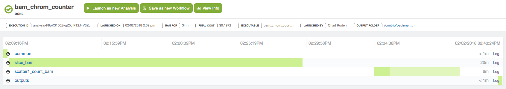

Note: dxWDL is now in maintaince mode. It will continue to receive bug fixes, but will have no new features. All new development is occurring in the [dxCompiler](https://github.com/dnanexus/dxCompiler) repository.

dxWDL takes a pipeline written in the
[Workflow Description Language (WDL)](http://www.openwdl.org/)
and compiles it to an equivalent workflow on the DNAnexus platform.
WDL draft-2, version 1.0, and the development version are supported. Note
that calls with missing arguments have limited support.

A high level list of changes between draft-2 and version 1.0 is
provided [here](doc/WdlVersionChanges.md).

## Setup

Prerequisites: DNAnexus platform account, dx-toolkit, java 8+, python 2.7/3.x.

Make sure you've installed the dx-toolkit CLI, and initialized it with
`dx login`. Download the latest compiler jar file from the
[releases](https://github.com/dnanexus/dxWDL/releases) page.

## Example workflow

The `bam_chrom_counter` workflow is written in WDL. Task
`slice_bam` splits a bam file into an array of sub-files. Task
`count_bam` counts the number of alignments on a bam file. The
workflow takes an input bam file, calls `slice_bam` to split it into chromosomes, and
calls `count_bam` in parallel on each chromosome. The results comprise a
bam index file, and an array with the number of reads per chromosome.

```wdl
workflow bam_chrom_counter {
    File bam

    call slice_bam {
        input : bam = bam
    }
    scatter (slice in slice_bam.slices) {
        call count_bam {
            input: bam = slice
        }
    }
    output {
        slice_bam.bai
        count_bam.count
    }
}

task slice_bam {
    File bam
    Int num_chrom = 22
    command <<<
    set -ex
    samtools index ${bam}
    mkdir slices/
    for i in `seq ${num_chrom}`; do
        samtools view -b ${bam} -o slices/$i.bam $i
    done
    >>>
    runtime {
        docker: "quay.io/ucsc_cgl/samtools"
    }
    output {
        File bai = "${bam}.bai"
        Array[File] slices = glob("slices/*.bam")
    }
}

task count_bam {
    File bam
    command <<<
        samtools view -c ${bam}
    >>>
    runtime {
        docker: "quay.io/ucsc_cgl/samtools"
    }
    output {
        Int count = read_int(stdout())
    }
}
```

From the command line, we can compile the workflow to the DNAnexus platform using the dxWDL jar file.
```
$ java -jar dxWDL-0.59.jar compile bam_chrom_counter.wdl -project project-xxxx
```

This compiles the source WDL file to several platform objects.
- A workflow `bam_chrom_counter`
- Two applets that can be called independently: `slice_bam`, and `count_bam`
- A few auxiliary applets that process workflow inputs, outputs, and launch the scatter.

These objects are all created in the current `dx` project and folder. The generated workflow can
be run using `dx run`. For example:
```
dx run bam_chrom_counter -i0.file=file-xxxx
```

At runtime this looks like this:


## Strict syntax

One of the compiler phases takes a workflow apart, and extracts standalone tasks and sub-workflows. This requires a lexical analysis on the WDL program. It currently uses a simple regular expression to detect task/workflow start and end. This means that a task has to adhere to the following rules:
1. no extra text is allows after the final closing bracket
2. within the task body, closing brackets may not start at the beginning of a line.

Here is an example to avoid:
```wdl
task foo {
input {
    File ref
}
command {
    ls -lh ~{ref}
}
}
```

It should be written like this:
```wdl
task foo {
    input {
        File ref
    }
    command {
        ls -lh ~{ref}
    }
}
```


## Additional information

- [Advanced options](doc/ExpertOptions.md) explains additional compiler options
- [Internals](doc/Internals.md) describes current compiler structure (_work in progress_)
- [Internals v0.81](doc/Internals_v_081.md) describes design for version 0.81 and prior.
- [Tips](doc/Tips.md) examples for how to write good WDL code

## Contributing to dxWDL

See [development](development/) for more information on how to set up your development environment to contribute to dxWDL and how to test your updates.

## Contributions

This software is a community effort! You can browse any of the contributions, that are not a part of dxWDL main source codebase, below in our [contrib](contrib) folder, and add your own (see [Contributing to dxWDL](#Contributing-to-dxWDL)).

## Issues and feature requests

[Let us know](https://github.com/dnanexus/dxWDL/issues) if you would like to contribute, request a feature, or report a bug.
