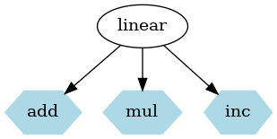
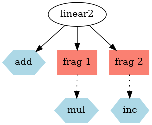
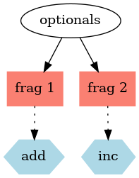
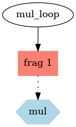
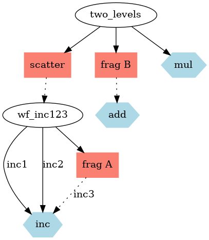

# Compiler internals

The compiler processes a WDL file in several phases:

- WOM: use the Cromwell
[WOM library](https://github.com/broadinstitute/cromwell/tree/develop/wom/src)
to read a WDL file, parse it, type check it, and create a WOM data
structure represention
- IR: generate Intermediate Code (_IR_) from the WOM representation
- Native: generate platform applets and workflows from the intermediate code

A WDL workflow is compiled into an equivalent DNAnexus
workflow, enabling running it on the platform. The basic mapping is:

* A WDL task compiles to a DNAx applet (_dx:applet_).
* A WDL workflow compiles to a DNAx workflow (_dx:workflow_)
* A WDL call compiles to a dx workflow stage, and sometimes an auxiliary applet
* Scatters and conditional blocks are compiled into workflow stages, plus an auxiliary applet

There are multiple obstacles to overcome. We wish to avoid creating a
controlling applet that would run and manage a WDL workflow. Such an
applet might get killed due to temporary resource shortage, causing an
expensive workflow to fail. Further, it is desirable to minimize the
context that needs to be kept around for the WDL workflow, because it
limits job manager scalability.


## Type mapping
WDL supports complex and recursive data types, which do not have
native support. In order to maintain the usability of the UI, when possible,
we map WDL types to the dx equivalent. This works for primitive types
(`Boolean`, `Int`, `String`, `Float`, `File`), and for single dimensional arrays
of primitives. However, difficulties arise with complex types. For
example, a ragged array of strings `Array[Array[String]]` presents two issues:

1. Type: Which dx type to use, so that it will be presented intuitively in the UI
2. Size: ragged arrays may get very large. A naive approach is to serialize them
as strings. However, this has resulted in strings in excess of 100KB for real
world workflows. This is too large to present comfortably on the screen.

The type mapping for primitive types is:

| WDL type       |  DNAx type |
| -------------- |  --------------- |
| Boolean        |   boolean |
| Int            |   int  |
| Float          |   float |
| String         |   string |
| File           |   file |


Optional primitives are mapped as follows:

| WDL type       |  DNAx type |  optional |
| -------------- |  --------------- | -------------       |
| Boolean?       |   boolean    | true |
| Int?           |   int        | true |
| Float?         |   float      | true |
| String?        |   string     | true |
| File?          |   file       | true |


Single dimensional arrays of WDL primitives are mapped to DNAx optional arrays, because
it allows them to be empty. The default DNAx array type is required to have at least one
element.

| WDL type       |  DNAX type | optional |
| -------------- |  --------------- | -------------       |
| Array[Boolean] |   array:boolean    | true |
| Array[Int]     |   array:int  | true |
| Array[Float]   |   array:float | true |
| Array[String]  |   array:string | true |
| Array[File]    |   array:file | true |


WDL types that fall outside these categories (e.g. ragged array of
files `Array[Array[File]]`) are mapped to two fields: a flat array of
files, and a hash, which is a json serialized representation of the
WDL value. The flat file array informs the job manager about data
objects that need to be closed and cloned into the workspace.

## Imports and nested namespaces

A WDL file creates its own namespace. It may import other WDL files,
each inhabiting its own namespace. Tasks and workflows from
children can be called with their fully-qualified-names. We map the
WDL namespace hierarchy to a flat space of *dx:applets* and
*dx:workflows* in the target project and folder. To do this, we
make sure that tasks and workflows are uniquely named.

In a complex namespace, a task/workflow can have several definitions. Such
namespaces cannot be compiled by dxWDL.


## Compiling a task

A task is compiled into an applet that has an equivalent
signature. For example, a task such as:

```wdl
version 1.0

task count_bam {
    input {
        File bam
    }
    command <<<
        samtools view -c ${bam}
    >>>
    runtime {
        docker: "quay.io/ucsc_cgl/samtools"
    }
    output {
        Int count = read_int(stdout())
    }
}
```

is compiled into an applet with the following `dxapp.json`:

```json
{
  "name": "count_bam",
  "dxapi": "1.0.0",
  "version": "0.0.1",
  "inputSpec": [
    {
      "name": "bam",
      "class": "file"
    }
  ],
  "outputSpec": [
    {
      "name": "count",
      "class": "int"
    }
  ],
  "runSpec": {
    "interpreter": "bash",
    "file": "code.sh",
    "distribution": "Ubuntu",
    "release": "16.04"
  }
}
```

The `code.sh` bash script runs the docker image `quay.io/ucsc_cgl/samtools`,
under which it run the shell command `samtools view -c ${bam}`.

## A Linear Workflow

Workflow `linear` (below) takes integers `x` and `y`, and calculates
`2*(x + y) + 1`.
Integers are used for simplicity; more complex types such as maps or arrays
could be substituted, keeping the compilation process exactly the
same.

```wdl
version 1.0

workflow linear {
    input {
        Int x
        Int y
    }

    call add {input: a = x, b = y }
    call mul {input: a = add.result, b = 2 }
    call inc {input: a = mul.result }

    output {
        Int result = inc.result
    }
}

# Add two integers
task add {
    input {
      Int a
      Int b
    }
    command {}
    output {
        Int result = a + b
    }
}

# Multiply two integers
task mul {
    input {
        Int a
        Int b
    }
    command {}
    output {
        Int result = a * b
    }
}

# Add one to an integer
task inc {
    input {
        Int a
    }
    command {}
    output {
        Int result = a + 1
    }
}

```

`linear` has no expressions and no if/scatter blocks. This allows
direct compilation into a dx:workflow, which schematically looks like
this:


| phase   | call   | arguments |
|-------  | -----  | ----      |
| Inputs  |        |     x, y  |
| Stage 1 | applet add | x, y  |
| Stage 2 | applet mul | stage-1.result, 2 |
| Stage 3 | applet inc | stage-2.result |
| Outputs |        | sub.result |

In addition, there are three applets that can be called on their own:
`add`, `mul`, and `inc`. The image below shows the workflow as an
ellipse, and the standalone applets as light blue hexagons.



## Fragments

The compiler can generate applets that are able to fully process
simple parts of a larger workflow. These are called *fragments*. A
fragment comprises a series of declarations followed by (1) a call, or
(2) a conditional block, or (3) a scatter block. Native workflows
do not support variable lookup, expressions, or evaluation. This means
that we need to launch a job even for a trivial expression. The
compiler tries to batch such evaluations together, to minimize the
number of jobs. For example,workflow `linear2` is split into three fragments.

```wdl
workflow linear2 {
    input {
        Int x
        Int y
    }

    call add { input: a=x, b=y }

    Int z = add.result + 1
    call mul { input: a=z, b=5 }

    call inc { input: i= z + mul.result + 8}

    output {
        Int result = inc.result
    }
}
```

Task `add` can be called directly, no fragment is required. Fragment-1 evaluates expression `add.result + 1`, and then calls `mul`.
```wdl
    Int z = add.result + 1
    call mul { input: a=z, b=5 }
```

Fragment-2 evaluates `z + mul.result + 8`, and then calls `inc`.
```wdl
    call inc { input: i= z + mul.result + 8}
```


Workflow `linear2` is compiled into:

| phase   | call   | arguments |
|-------  | -----  | ----      |
| Inputs  |        |     x, y  |
| Stage 1 | applet add | x, y  |
| Stage 2 | applet fragment-1 | stage-1.result |
| Stage 3 | applet fragment-2 | stage-2.z, stage-2.mul.result |
| Outputs |        | stage-3.result |



Workflow `optionals` uses conditional blocks. It can be broken down into two fragments.

```wdl
workflow optionals {
    input {
        Boolean flag
        Int x
        Int y
    }

    if (flag) {
        call inc { input: a=x }
    }
    if (!flag) {
        call add { input: a=x, b=y }
    }

    output {
        Int? r1 = inc.result
        Int? r2 = add.result
    }
}
```

Fragment 1:
```wdl
    if (flag) {
        call inc { input: a=x }
    }
```

Fragment 2:
```wdl
    if (!flag) {
        call add { input: a=x, b=y }
    }
```

The fragments are linked together into a dx:workflow like this:

| phase   | call   | arguments |
|-------  | -----  | -------   |
| Inputs  |        |     flag, x, y  |
| Stage 1 | applet fragment-1 | flag, x |
| Stage 2 | applet fragment-2 | flag, x, y |
| Outputs |        | stage-1.inc.result, stage-2.add.result |





Workflow `mul_loop` loops through the numbers *0, 1, .. n*, and
multiplies them by two. The result is an array of integers.

```wdl
workflow mul_loop {
    input {
        Int n
    }

    scatter (item in range(n)) {
        call mul { input: a = item, b=2 }
    }

    output {
        Array[Int] result = mul.result
    }
}
```

It is compiled into:

| phase   | call   | arguments |
|-------  | -----  | -------   |
| Inputs  |        |     n  |
| Stage 1 | applet fragment-1 | n |
| Outputs |        | stage-1.mul.result |

The fragment is executed by an applet that calculates the WDL
expressions `range(n)`, iterates on it, and launches a child job for
each vlues of `item`. In order to massage the results into the proper
WDL types, we run a collect sub-job that waits for the child jobs to
complete, and returns an array of integers.



## Nested blocks

WDL allows blocks of scatters and conditionals to
be nested arbitrarily. Such complex workflows
are broken down into fragments, and tied together with
subworkflows. For example, in workflow `two_levels` the scatter block
requires a subworkflow that will chain together the calls `inc1`,
`inc2`, and `inc3`. Note that `inc3` requires a fragment because it
needs to evaluate and export declaration `b`.

```wdl
workflow two_levels {
    input {
    }

    scatter (i in [1,2,3]) {
        call inc as inc1 { input: a = i}
        call inc as inc2 { input: a = inc1.result }

        Int b = inc2.result

        call inc as inc3 { input: a = b }
    }

    if (true) {
        call add { input: a = 3, b = 4 }
    }

    call mul {input: a=1, b=4}

    output {
        Array[Int] a = inc3.result
        Int? b = add.result
        Int c = mul.result
    }
}
```

It will be broken down into five parts. A sub-workflow will tie the
first three pieces together:

Part 1:
```wdl
        call inc as inc1 { input: a = i}
```

Part 2:
```wdl
        call inc as inc2 { input: a = inc1.result }
```

Part 3 (fragment *A*):
```wdl
        Int b = inc2.result
        call inc as inc3 { input: a = b }
```

The top level workflow calls a scatter applet, which calls the sub-workflow. Later,
it calls parts four and five.

Part 4 (fragment *B*):
```wdl
    if (true) {
        call add { input: a = 3, b = 4 }
    }
```

Part 5:
```wdl
    call mul {input: a=1, b=4}
```

The overall structure is


